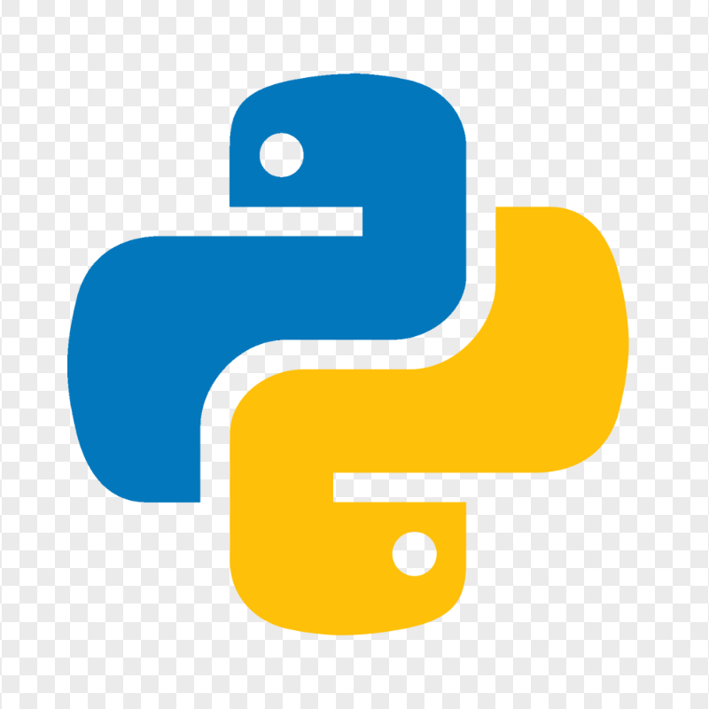
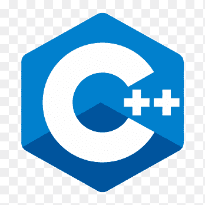
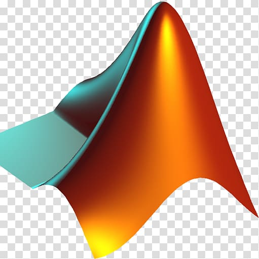
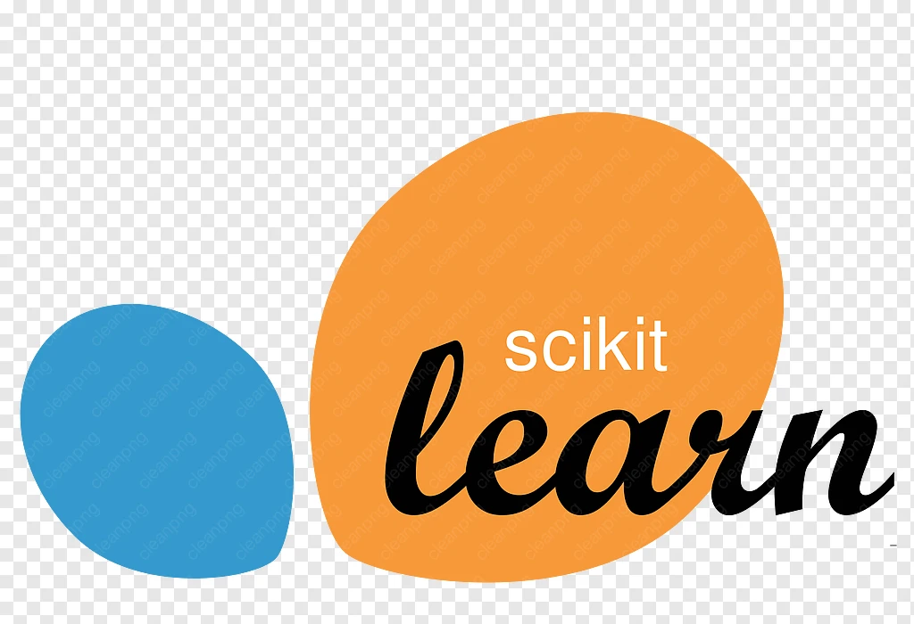

  

  <a href="https://YOUR_PORTFOLIO_URL">Website</a> ·
  <a href="https://YOUR_LINKEDIN_URL">LinkedIn</a> ·
  <a href="https://YOUR_CV_URL">CV</a> ·
  <a href="mailto:YOUR_EMAIL">Email</a>

---

## About

Senior Electrical Engineering student at NYU Abu Dhabi interested in intelligent physical systems, particularly robotics, autonomy, dynamics, and control.

- Undergraduate researcher at **NYU WIRELESS / NYU Tandon**, studying spectrum prediction and model generalization.
- Interested in how algorithms, sensing, control, and physical hardware come together in autonomous systems.
- Currently exploring research directions in robotics and autonomous systems.

---

## Research & Publications

### What Do Spectrum Prediction Models Actually Learn?

**Manuscript under review**

A controlled benchmark of spectrum prediction models across multiple wireless research testbeds, examining whether strong forecasting performance reflects meaningful temporal, spectral, and spatial learning and whether these models generalize across environments.

`Spectrum Prediction` `Machine Learning` `Time Series` `Wireless Systems`

[Code](https://YOUR_CODE_URL) · [Poster](https://YOUR_POSTER_URL)

---

## Tools I Use

### Programming

  
  
  

Python · C++ · C · MATLAB · VHDL

### Machine Learning & Scientific Computing

  
  
  
  

PyTorch · NumPy · Pandas · scikit-learn · Matplotlib

### Development & Research

  
  
  
  

Git · GitHub · Jupyter · LaTeX

---

## Quick Links

- **Portfolio:** [Website](https://YOUR_PORTFOLIO_URL)
- **LinkedIn:** [LinkedIn](https://YOUR_LINKEDIN_URL)
- **CV:** [CV](https://YOUR_CV_URL)
- **Email:** [Email](mailto:YOUR_EMAIL)
