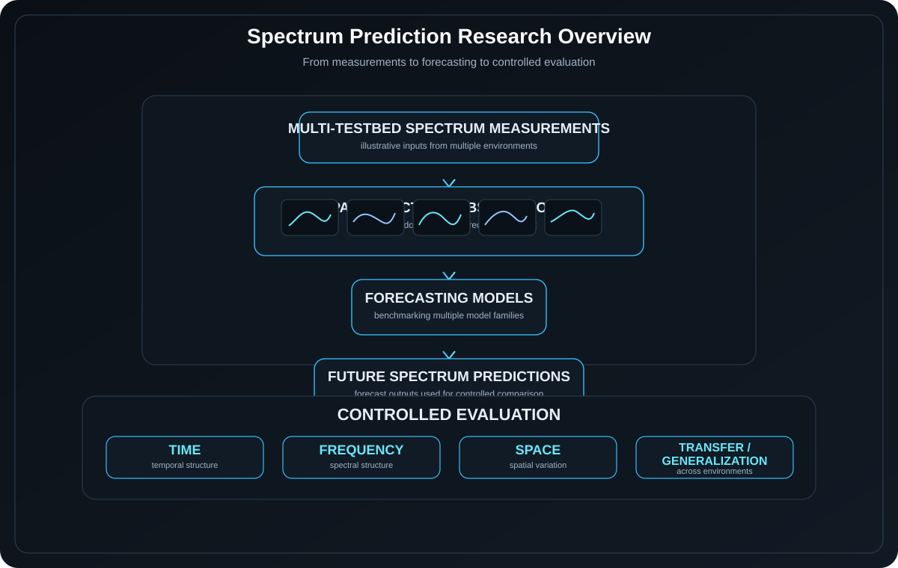

  

  <a href="YOUR_PORTFOLIO_URL">Portfolio</a>
  ·
  <a href="YOUR_LINKEDIN_URL">LinkedIn</a>
  ·
  <a href="YOUR_CV_URL">CV</a>
  ·
  <a href="mailto:YOUR_EMAIL">Email</a>

## About

Senior Electrical Engineering student at NYU Abu Dhabi interested in intelligent physical systems, particularly robotics, autonomy, dynamics, and control.

- Undergraduate researcher at **NYU WIRELESS / NYU Tandon**, studying spectrum prediction and model generalization.
- Interested in how algorithms, sensing, control, and physical hardware come together in autonomous systems.
- Currently exploring research directions in robotics and autonomous systems.

  

## Research & Publications

  

### What Do Spectrum Prediction Models Actually Learn?

**Manuscript under review**

A controlled benchmark of spectrum prediction models across multiple wireless research testbeds, examining whether strong forecasting performance reflects meaningful temporal, spectral, and spatial learning and whether these models generalize across environments.

`Spectrum Prediction` · `Machine Learning` · `Time Series` · `Wireless Systems`

[Code](YOUR_CODE_URL) · [Poster](YOUR_POSTER_URL)

  

## Tools I Use

`Coming next.`

  

## Quick Links

- [Portfolio](YOUR_PORTFOLIO_URL)
- [LinkedIn](YOUR_LINKEDIN_URL)
- [CV](YOUR_CV_URL)
- [Email](mailto:YOUR_EMAIL)
